```{r setup, include=FALSE}
knitr::opts_chunk$set(echo = TRUE)
```

## What is GLM ?

**Generalized linear model** (GLM)  is a generalization of linear models, allowing for modeling of data with exponential distributions and for categorical data (classification). GLM models are fitted by solving the maximum likelihood optimization problem. GLM include:

 - linear regression
 - logistic regression
 - Poisson regression
 - gamma regression
 - and more...
 

## Visualization of GLM

\begin{equation}
\begin{cases}
y\sim NEF(\mu(\theta),\phi) \\
g(\mu)=\eta=X\beta
\end{cases}
\end{equation}

<center>
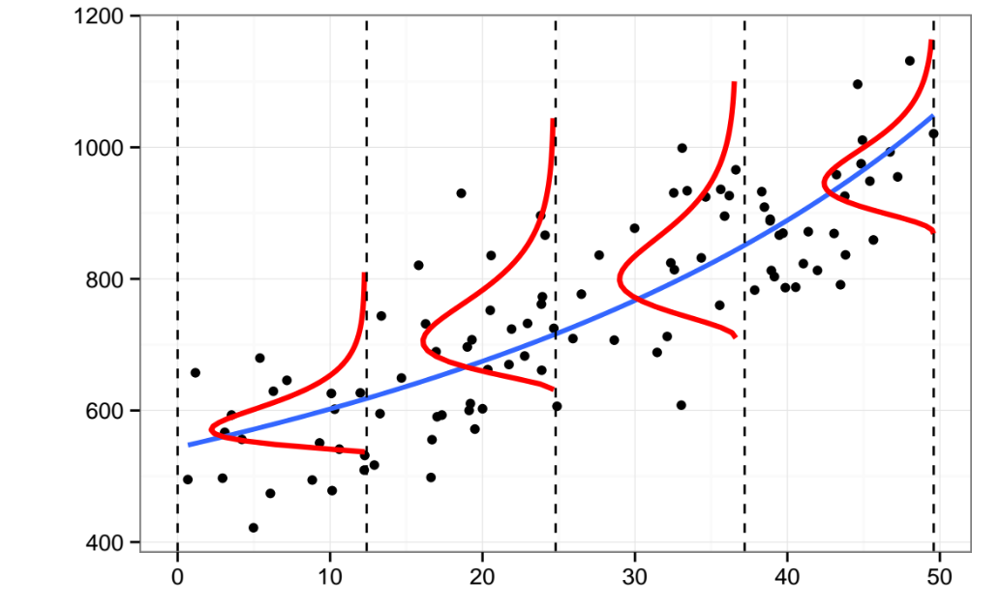
</center>

## Linear regression as GLM

\begin{equation}
\begin{cases}
y\sim \mathcal{N}(\mu,\sigma^2) \\
\mu=\beta_0+\beta_1X_1+...+\beta_pX_p
\end{cases}
\end{equation}

<center>

</center>

## How to find Beta's ?

Minimize th **RMSE**

\begin{equation}
RMSE(\hat{\beta})=\sqrt{\frac{1}{n}(y-X\hat{\beta})^T(y-X\hat{\beta})}
\end{equation}

<center>
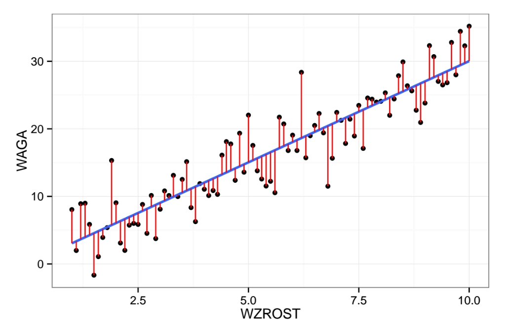
</center>

## Logistic regression as GLM

\begin{equation}
\begin{cases}
y\sim Bernoulli(p) \\
logit(\mu)=logit(p)=ln(\frac{p}{1-p})=\eta=X\beta
\end{cases}
\end{equation} 

<center>
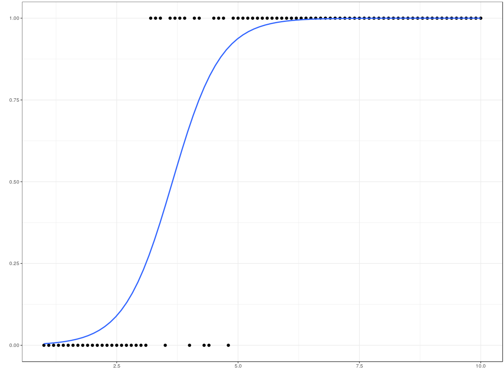
</center>

## GLM in H2O - Loss function + Elastic Net Penalty

\begin{equation}
min_{\beta,\beta_0} \frac{1}{n}ln(L(family,\beta,\beta_0)) +\lambda(\alpha||\beta||_1+ \frac{1-\alpha}{2}||\beta||^2_2)
\end{equation}

For example in linear regression we have:

\begin{equation}
min_{\beta,\beta_0} (y-X\hat{\beta})^T(y-X\hat{\beta}) +\lambda(\alpha||\beta||_1+ \frac{1-\alpha}{2}||\beta||^2_2)
\end{equation}

## Inbalanced data

<center>
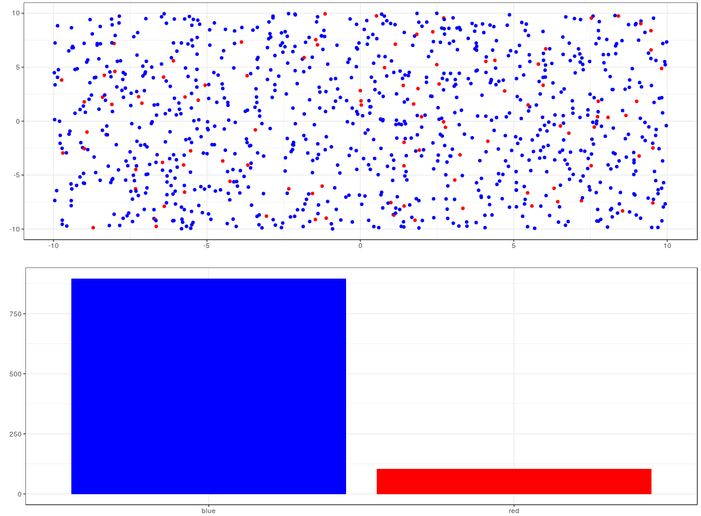
</center>

## Undersampling

<center>
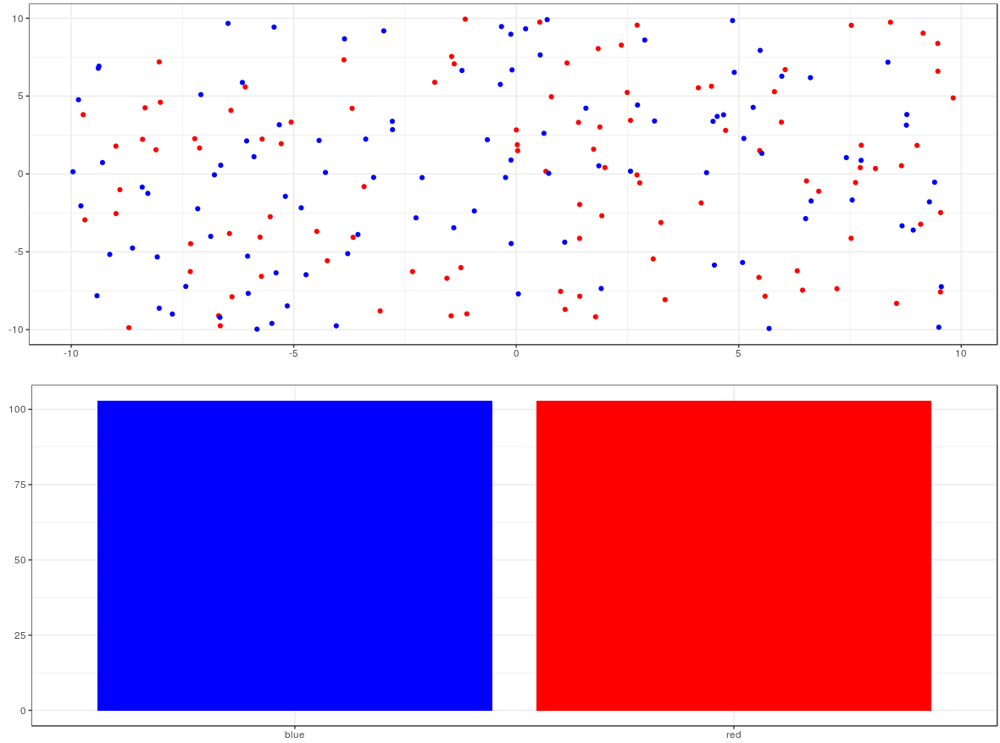
</center>

## Oversampling

<center>
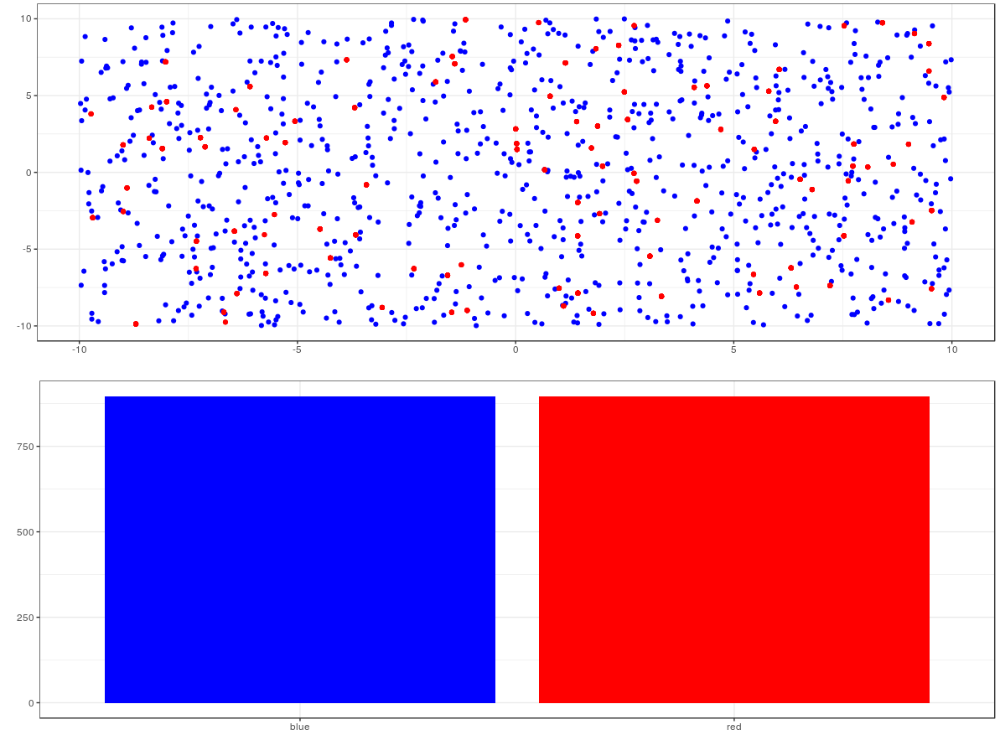
</center>

## Precision and Recall

<center>
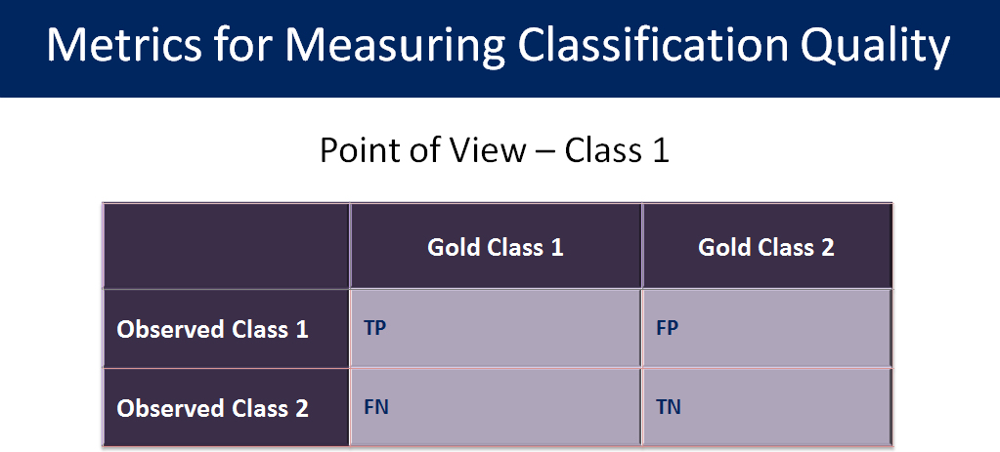


$Precision=\frac{TP}{TP+FP}$

$Recall=\frac{TP}{TP+FN}$

</center>

## F-score

<center>

$F_b=\frac{(b^2+1)PR}{b^2P+R}$

 - $b=0$ means $F=$ precision
 - $b=\infty$ means $F=$ recall
 - $b=1$ means recall and precision equally weighted
 - $b=0.5$ means recall is half as importatnt as precision
 - $b=2$ means recall is twice as importatnt as precision

</center>

## Single neuron

<center>
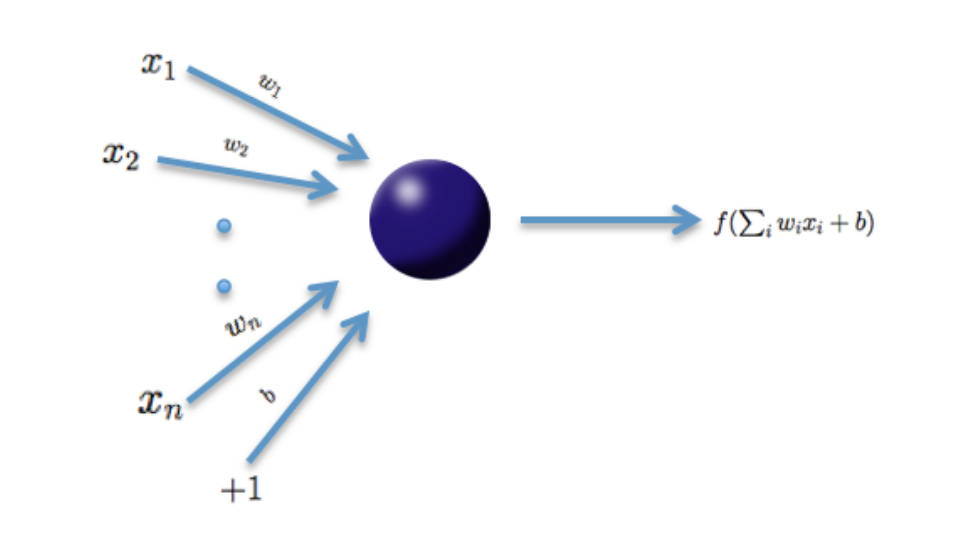
</center>

## Feedforward neural network

<center>
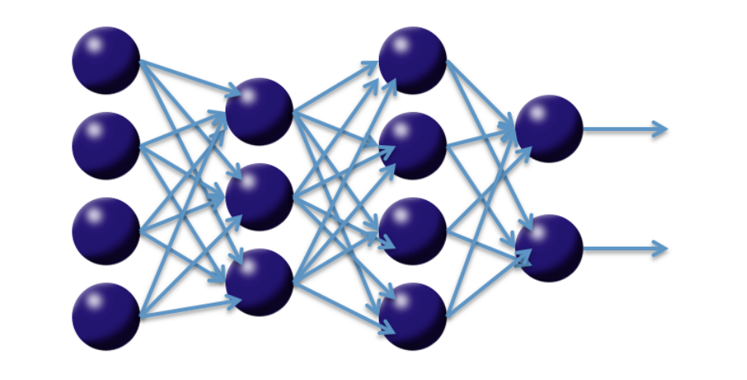
</center>

## Activation functions in H2O

<center>
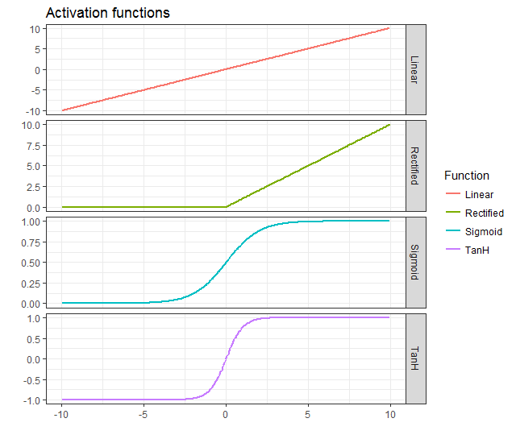
</center>


## Grid and Random Search

<center>
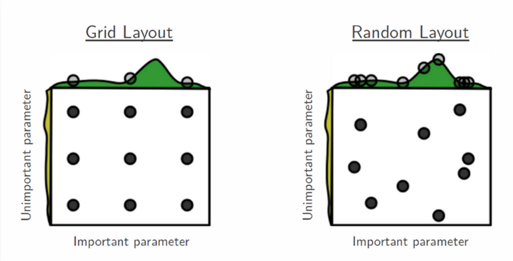
</center>

## K-means

K-means clustering is a type of unsupervised learning, which is used when you have unlabeled data (i.e., data without defined categories or groups). The goal of this algorithm is to find groups in the data, with the number of groups represented by the variable K.

Basic Algorithm

1. Choose arbitrary k points and set them as initial centroids (means).
2. Arrange all objects to the nearest centroid (using Euclidean distance).
3. Update centroids (calculate the average value of observation for each cluster).
4. Repeat steps 2 and 3 until the centroid changes.

## K-means

<center>
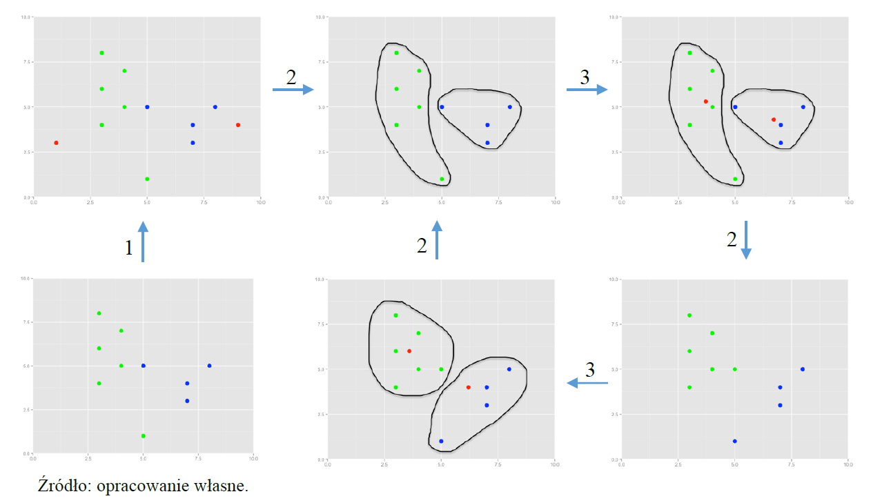
</center>

## PCA

**Principal component analysis** (PCA) is a statistical procedure that uses an orthogonal transformation to convert a set of observations of possibly correlated variables into a set of values of linearly uncorrelated variables called **principal components** (or sometimes, principal modes of variation). 

The number of principal components is less than or equal to the smaller of the number of original variables or the number of observations. This transformation is defined in such a way that the first principal component has the largest possible variance (that is, accounts for as much of the variability in the data as possible)

## PCA

<center>
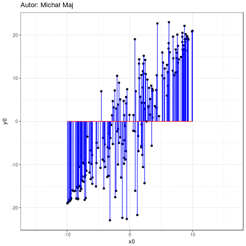
</center>